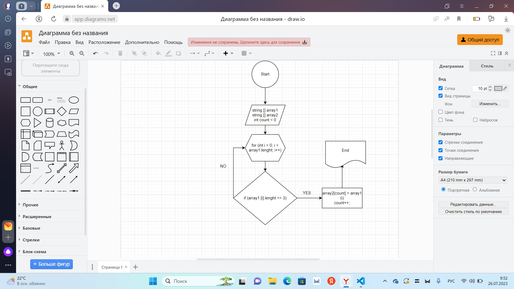

# Итоговая контрольаня работа по основному блоку 

## Задача: 
### Написать программу, которая из имеющегося массива строк формирует новый массив из строк, длина которых меньше, либо равна 3 символам. Первоначальный массив можно ввести с клавиатуры, либо задать на старте выполнения алгоритма. При решении не рекомендуется пользоваться коллекциями, лучше обойтись исключительно массивами.

## Алгоритм решения: 
### Создается два массива, одинаковой длины. С поощью метода проверям условие, что переменная по длин должна быть меньше 3х символов ( <= 3) в первом методе, если услове соблюдается, то переносится во второй массив. Проверяем весь массив с помощью цикла for, выводим второй массив в котором соблюдается условие ( <=3 ).
